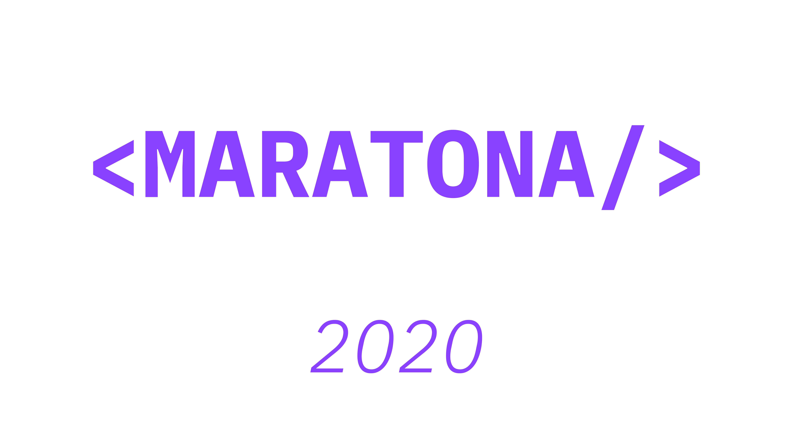

<h1 align="center">
    
</h1>

<h1 align="center">MBTC | Gerador JSON Desafio 3 (FIAP) </h1>
 
> Este projeto é de propósito estudantil, nenhum elemento nele contido deriva-se para usuários finais. Nenhuma informação aqui inserida será guardada ou repassada para terceiros.

	

  

   
  
   

  <a href="#-Descrição">Descrição</a>&nbsp;&nbsp;&nbsp;|&nbsp;&nbsp;&nbsp;
  <a href="#-Projeto">Projeto</a>&nbsp;&nbsp;&nbsp;|&nbsp;&nbsp;&nbsp;
  <a href="#-Tecnologias">Tecnologias</a>&nbsp;&nbsp;&nbsp;|&nbsp;&nbsp;&nbsp;

## ✍ Descrição: Como funciona o projeto??

Criação de uma ferramenta para que pessoas que tenham dificuldade em gerar arquivos JSON no desafio 3. Derivado a participantes no qual não tenham muito contato com tecnologias front-end.

## 🚀  Projeto: Gerador de JSON

# ⚠️ IMPORTANTE !!!
> ⚠️ Para funcionar nas paginas do TED é necessário que o usuário desça a pagina até aparecer o nome do Autor e Titulo do vídeo. Como mostrado abaixo.

<h1 align="center">
    
</h1>

> Revise sempre o json antes de submeter! http://json.parser.online.fr/ 

## 🛸 Tecnologias

This project was developed with the following technologies:

| Check | Descriçao | Tecnologias |
|:---:|---------|:-----------:|
| [x]  |DropBox Clone|      |
